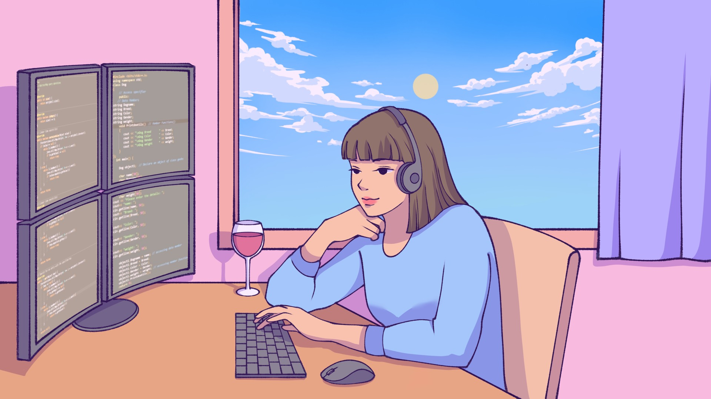

  
  
  <h1>Hi there, I'm Fabiana! 👋</h1>

  

    <strong>Backend Engineer</strong>
  

  

    Building robust server-side architectures and exploring the frontiers of AI-driven development.
  

  

---

### 👩🏻‍💻 About Me

- 🚀 **Project I'm proud of:** A full-stack parking web app built with `Next.js` and `NestJS`.
- 📚 **Learning:** Exploring AI workflows with [Claude Code](https://anthropic.skilljar.com/).
- 🍷 **Fun Fact:** I'm a big wine enthusiast. I like to think of it as the original "backend process"—it takes time, the right environment, and a lot of testing to get the final output just right.

---

### 🛠️ Technologies & Tools

  
  
  
  
  
  
  
  
  
  

---

### 🏆 Achievements

  
  
<i>RotaCloud Hackathon Participant</i>

---

### 📊 GitHub Stats

  
  

 

  

